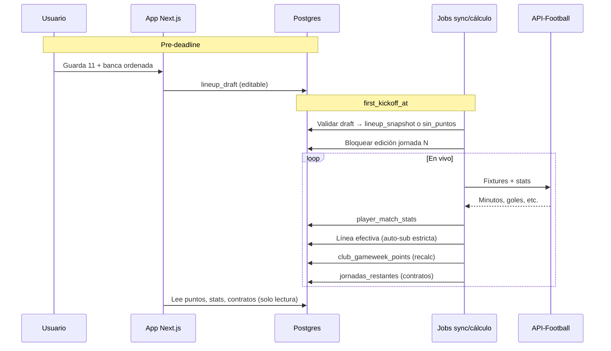

# Sprint 2 — Diseño: jornadas reales, plantilla 11+5+8 y motor automático

Documento de producto y arquitectura **antes de implementación**.  
Sprint 1 = loop mock. Sprint 2 = Liga Colombiana real con stats, puntos y contratos automáticos.

---

## Objetivo

Conectar PRESI a **jornadas reales de Liga Colombiana**:

1. Jugadores reales (API-Football → `players_master`).
2. El usuario arma **11 inicial + banca (5)** antes del primer partido; el resto es **reserva**.
3. Stats entran por **sync automático a la DB**; la app **solo lee la DB**.
4. **Puntos** y **consumo de contratos** se calculan solos (en vivo), sin botón manual.

---

## Fuera de alcance (Sprint 2)

| Feature | Sprint |
|---------|--------|
| Mercado P2P | 3+ |
| Préstamo → compra en contratos | 3+ |
| Pagos reales | Futuro |
| App nativa | Futuro |

---

## Reglas de producto (cerradas)

### Plantilla del club

| Nivel | Cantidad | Descripción |
|-------|----------|-------------|
| **11 inicial** | 11 | Titulares; formación válida (7 esquemas actuales en `formation.ts`) |
| **Banca** | 5 | Suplentes oficiales, **ordenados 1→5** |
| **Reserva** | hasta 8 | Resto de plantilla; no participa en la jornada |
| **Total máximo** | **24** | 11 + 5 + 8 |

- La reserva **no es obligatoria**: cualquier jugador fuera del 11 y la banca queda en reserva.
- Un club puede tener menos de 24 jugadores.

### Caps por posición (propuesta para 24)

| Posición | Máximo |
|----------|--------|
| GK | 3 |
| DEF | 8 |
| MED | 8 |
| DEL | 7 |

> Sustituye el cap Sprint 1 de 16 (2/5/5/4). Validar en balance al implementar fichajes.

### Deadline de alineación

- El usuario debe guardar **11 inicial + banca (5)** **antes del primer partido** de la jornada (UX / CTA `isValid`).
- **Al primer pitido**: snapshot bloqueado (`lineup_snapshot`). No se puede editar 11 ni banca hasta la siguiente jornada.
- Una alineación incompleta **sí puntúa** los jugadores que estén seleccionados; slots vacíos aportan 0. `isValid` es solo guía de UI, no anula el club.

### Durante la jornada

- **No** se cambia plantilla (11, banca, orden).
- **No** existe botón «Confirmar jornada» (eliminar `confirmGameweek()` del mock).
- Countdown en UI = tiempo real al **primer partido** de la jornada actual.

### Auto-sustitución (banca, posición estricta)

Si un titular del 11 **no juega** (0 minutos según stats en DB):

1. Recorrer la banca en orden **1 → 5**.
2. El primer suplente con la **misma posición** (GK→GK, DEF→DEF, MED→MED, DEL→DEL) entra a la **línea efectiva** para puntos.
3. Cada suplente cubre **como máximo un** hueco.
4. Sin suplente compatible → ese hueco **0 puntos**.

La reserva **nunca** entra por auto-sustitución.

### Puntos

| Caso | ¿Suma puntos? |
|------|----------------|
| Titular del 11, ≥ 1 min | Sí |
| Titular 0 min → banca entra (misma posición), ≥ 1 min | Sí (stats del suplente) |
| Banca que no entra | No |
| Reserva | **Nunca** |
| Alineación incompleta | Sí, solo jugadores alineados (slots vacíos = 0) |
| Gimnasio | +N% sobre el **total de la jornada** (no se muestra en ranking global) |

- Actualización **en vivo**: cada sync de stats dispara recálculo (o job incremental).
- Reglas de puntuación fantasy: definir en `src/lib/game/scoring.ts` (goles, asistencias, clean sheet, etc.) — tabla en § Puntuación.

### Contratos (partidos restantes)

| Caso | ¿−1 partido de contrato? |
|------|----------------------------|
| Jugador en **línea efectiva** (11 o banca que entró), ≥ 1 min | Sí |
| 0 minutos | No |
| Reserva | **No**, aunque juegue en la vida real |

- Umbral: **≥ 1 minuto** (stats en DB).
- Descuento **automático** al procesar stats de la jornada; no manual.

### Ownership entre clubes

- Varios clubes **pueden** tener el mismo jugador en `club_roster`.
- Un club **no puede** tener duplicado al mismo jugador (PK `(club_id, player_id)` + `canAddPlayer`).

---

## Flujos

### Flujo de jornada



### Línea efectiva (ejemplo)

```
11 inicial:  GK, DEF×4, MED×4, DEL×2  (4-4-2)
Banca orden: 1.GK  2.DEF  3.MED  4.MED  5.DEL

Titular DEL #1 → 0 min
  → Banca 1 GK? No
  → Banca 2 DEF? No
  → Banca 3 MED? No
  → Banca 4 MED? No
  → Banca 5 DEL? Sí → entra a línea efectiva

Titular MED #2 → 0 min
  → Banca 1–4 ya usados o no coinciden
  → Sin MED restante en banca → hueco sin puntos
```

---

## Arquitectura de datos

| Capa | Rol |
|------|-----|
| **API-Football** | Solo servidor (cron/edge). Nunca desde el browser del usuario. |
| **Postgres** | Fuente de verdad: fixtures, stats, snapshots, puntos, contratos. |
| **App** | Lee DB; escribe solo draft de alineación y fichajes. |

### Variables de entorno (nuevas)

```env
API_FOOTBALL_KEY=...
API_FOOTBALL_LEAGUE_ID=...   # Liga Colombiana
API_FOOTBALL_SEASON=...
```

---

## Esquema de base de datos (propuesto)

### `gameweeks`

Jornadas de la liga real.

```sql
create table gameweeks (
  id uuid primary key default gen_random_uuid(),
  season integer not null,
  round integer not null,
  first_kickoff_at timestamptz not null,
  last_kickoff_at timestamptz,
  status text not null default 'upcoming'
    check (status in ('upcoming', 'live', 'finished')),
  unique (season, round)
);
```

### `fixtures`

Partidos por jornada.

```sql
create table fixtures (
  id uuid primary key default gen_random_uuid(),
  gameweek_id uuid references gameweeks not null,
  api_football_fixture_id integer unique not null,
  kickoff_at timestamptz not null,
  home_team text not null,
  away_team text not null,
  status text not null,
  updated_at timestamptz default now()
);
```

### `player_match_stats`

Stats por jugador y partido (sync desde API).

```sql
create table player_match_stats (
  id uuid primary key default gen_random_uuid(),
  fixture_id uuid references fixtures not null,
  player_id uuid references players_master not null,
  gameweek_id uuid references gameweeks not null,
  minutes integer not null default 0,
  goals integer not null default 0,
  assists integer not null default 0,
  yellow_cards integer not null default 0,
  red_cards integer not null default 0,
  clean_sheet boolean default false,
  goals_conceded integer default 0,
  updated_at timestamptz default now(),
  unique (fixture_id, player_id)
);
```

### `lineup_drafts`

Alineación editable **antes** del deadline.

```sql
create table lineup_drafts (
  club_id uuid references clubs not null,
  gameweek_id uuid references gameweeks not null,
  starter_ids uuid[] not null,       -- 11 player_ids
  bench_ids uuid[] not null,         -- 5 player_ids, orden = índice 0..4
  formation text,
  updated_at timestamptz default now(),
  primary key (club_id, gameweek_id),
  check (cardinality(starter_ids) = 11),
  check (cardinality(bench_ids) = 5)
);
```

### `lineup_snapshots`

Alineación **bloqueada** al primer pitido.

```sql
create table lineup_snapshots (
  club_id uuid references clubs not null,
  gameweek_id uuid references gameweeks not null,
  starter_ids uuid[] not null,
  bench_ids uuid[] not null,
  formation text,
  is_valid boolean not null default false,  -- false → 0 puntos
  locked_at timestamptz not null default now(),
  primary key (club_id, gameweek_id)
);
```

### `club_gameweek_points`

Puntos acumulados en vivo por club y jornada.

```sql
create table club_gameweek_points (
  club_id uuid references clubs not null,
  gameweek_id uuid references gameweeks not null,
  points numeric not null default 0,
  breakdown jsonb,                    -- detalle por jugador
  calculated_at timestamptz default now(),
  primary key (club_id, gameweek_id)
);
```

### `club_roster` (cambios)

```sql
-- Rol de plantilla (reemplaza lógica binaria es_titular para jornada)
alter table club_roster add column
  squad_role text check (squad_role in ('starter', 'bench', 'reserve'));

-- es_titular: deprecar tras migración UI → usar draft/snapshot por jornada
```

### `players_master` (sync API)

- Poblar `api_football_id`, nombres y equipos reales.
- Opcional: `photo_url`, `updated_at`.

---

## Jobs automáticos

| Job | Frecuencia | Acción |
|-----|------------|--------|
| `sync_gameweeks_fixtures` | Diario + pre-jornada | Calendario Liga Colombiana → `gameweeks`, `fixtures` |
| `lock_lineup_snapshots` | Al `first_kickoff_at` | Draft válido → snapshot; inválido → `is_valid = false` |
| `sync_live_stats` | Cada 5–15 min si jornada `live` | API → `player_match_stats` |
| `process_gameweek` | Tras cada sync de stats | Línea efectiva, puntos, contratos |
| `sync_players_master` | Semanal | Plantillas reales → `players_master` |

Implementación sugerida: **pg_cron** + Edge Function con `service_role`, mismo patrón que instalaciones.

---

## Puntuación fantasy

Motor por posición en `src/lib/game/scoring-rules.ts` (matriz GK/DEF/MED/DEL).  
Documentación completa: [`docs/SCORING.md`](SCORING.md).

| Evento | GK | DEF | MED | DEL |
|--------|----|-----|-----|-----|
| Gol | +10 | **+12** | +10 | **+8** |
| Asistencia | +8 | +8 | +8 | +8 |
| Titular | +3 | +3 | +3 | +3 |
| Victoria (≥55 min) | +5 | +5 | +5 | +5 |
| Empate (≥55 min) | +1 | +1 | +1 | +1 |
| Parada | +1 c/u | — | — | — |
| 60+ / 90+ pases | — | +3 / +6 | +3 / +6 | +3 / +6 |
| Tackle ganado | +1 | +1 | +1 | **+2** |
| Amarilla / Roja | −2 / −8 | −2 / −8 | −2 / −8 | −2 / −8 |
| GC extra (GK/DEF, ≥2 y ≥55 min) | −2 | −2 | — | — |

**Cuerpo médico** reduce penalizaciones negativas. **Capitán** duplica puntos del jugador.  
Breakdown línea por línea en `/inicio` desde `club_gameweek_points.breakdown`.

---

## Cambios en la app (UI / actions)

### Eliminar

- Botón **Confirmar jornada** en `HomeDashboard.tsx`
- Server action `confirmGameweek()` en `contracts.ts`

### Plantilla (`/plantilla`)

- Tres zonas: **11 inicial** (campo), **banca** (5 slots ordenados), **reserva** (lista).
- Drag o tap para mover entre zonas (respetando caps).
- Countdown al deadline de jornada actual.
- Estado: «Alineación lista» / «Falta guardar» / «Bloqueada — jornada en curso».
- Guardar → `saveLineupDraft(starterIds, benchIds)` (validación formación + 5 banca + jugadores del club).

### Inicio (`/inicio`)

- Puntos de jornada **en vivo** desde `club_gameweek_points`.
- Próximo partido / jornada real (no countdown mock).

### Ranking / ligas

- Puntos desde suma de jornadas reales (reemplazar o complementar `ranking_mock`).

---

## Lógica pura (`src/lib/game/`)

| Módulo | Responsabilidad |
|--------|-----------------|
| `scoring-rules.ts` | Matriz de puntos por posición + breakdown |
| `scoring.ts` | Agregación jornada, tipos, wrapper |
| `effective-lineup.ts` | Auto-sub estricta: snapshot + stats → línea efectiva |
| `gameweek-points.ts` | Puntos totales del club en una jornada |
| `contract-gameweek.ts` | Quién consume partido de contrato en jornada N |
| `squad-limits.ts` | Caps 24, roles 11+5+8, validación draft |
| `formation.ts` | Sin cambios (11 inicial) |

Tests obligatorios para auto-sub, 0 puntos sin snapshot, contrato con 1 min, reserva excluida.

---

## Orden de implementación

1. **Documento + migraciones** — tablas § Esquema; ampliar cap plantilla a 24.
2. **`lib/game`** — `effective-lineup`, `scoring`, tests.
3. **Sync API-Football** — jugadores + fixtures + stats (job mínimo).
4. **Lineup draft/snapshot** — actions + UI plantilla 11+5+8.
5. **Job `process_gameweek`** — puntos en vivo + contratos.
6. **UI inicio/ranking** — datos reales; quitar mock y confirmar jornada.
7. **Balance** — caps por posición, tabla de puntos, ingresos vs fichajes.

---

## Migración desde Sprint 1 / trabajo intermedio

| Actual | Acción |
|--------|--------|
| Cap 16 jugadores | Subir a 24; migrar roles |
| `es_titular` en `club_roster` | Migrar a draft por jornada; deprecar |
| `confirmGameweek()` | Eliminar |
| `ranking_mock` | Mantener fallback hasta puntos reales |
| Migraciones 03–05 (scouting, facilities, contracts) | Requeridas antes de QA Sprint 2 |
| Contratos solo por partidos | Mantener; cambiar trigger a `process_gameweek` |

---

## Checklist de cierre Sprint 2

- [x] API-Football sync jugadores Liga Colombiana
- [x] Fixtures y jornadas en DB
- [x] UI plantilla 11 + banca 5 + reserva 8
- [x] Snapshot automático al primer pitido
- [x] Alineación parcial puntúa jugadores alineados + auto-sub
- [x] Auto-sub estricta por posición
- [x] Puntos en vivo en `/inicio` (+ desglose)
- [x] Contratos automáticos (≥ 1 min, excluye reserva)
- [x] Ranking con `club_season_points` (sin badge gimnasio)
- [x] Gimnasio aplica % al total de jornada
- [x] Eliminado botón confirmar jornada
- [ ] QA manual jornada live post-deploy (ver `docs/SPRINT2_CHECKLIST.md`)

---

## Referencias en repo

| Tema | Archivo |
|------|---------|
| Formaciones válidas | `src/lib/game/formation.ts` |
| Contratos | `src/lib/game/contracts.ts` |
| Caps plantilla | `src/lib/game/squad-limits.ts` |
| Efectos instalaciones | `src/lib/game/facility-effects.ts` |
| Cron production | `.github/workflows/gameweek-cron.yml` |

---

*Última actualización: cierre Sprint 2 — puntuación parcial + auto-sub, gimnasio en jornada (oculto en ranking), cron GHA.*
